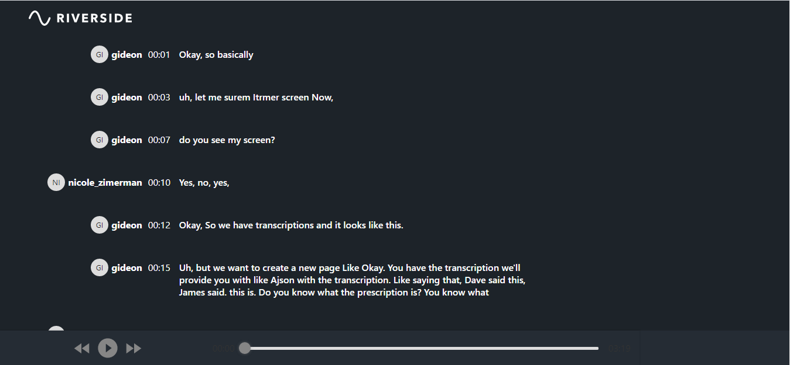

# ✨ RIVERSIDE CODING CHALLENGE 

This is a transcription component created with CRA. The objective is to make a app which renders the following attached JSON into a transcription view.
The transcription view should have an audio player. The words are highlighted in sync with the audio.

## 🎨 Preview


[DEMO](https://nicolezimerman.github.io/riverside-challenge/)

## 💻 Technology
HTML, CSS, REACTJS, Testing library

## 🚀 Installation

1. Clone project
2. Install the dependencies
```bash
npm install
```

## ⚙️ Usage
1. Go to project directory on the shell cd riverside-challenge
2. Run on the local host npm start This will be open on [http://localhost:3000]
```bash
npm start
```

## ⚙️ Test
1. Go to project directory on the shell cd riverside-challenge
2. Run the following command
```bash
npm test
```
